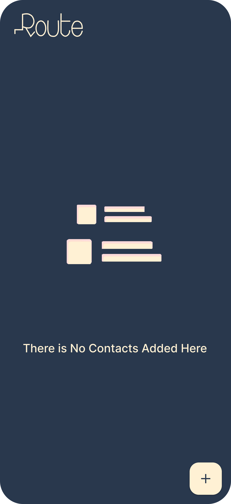
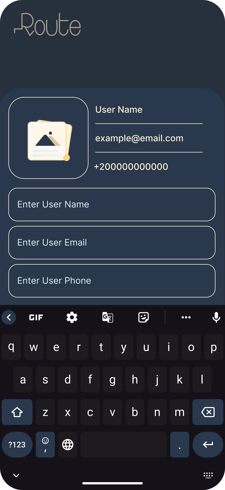
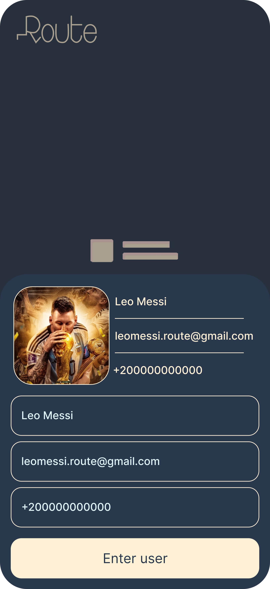
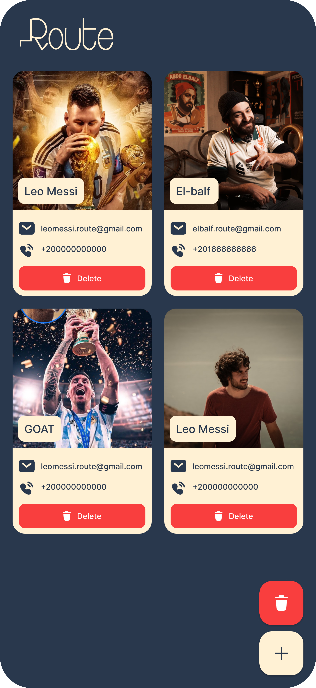

# 📇 Contact App

A clean, modern Flutter app for managing and browsing your contacts with style.


## 🧭 Overview

**Contact App** is a beautifully designed and intuitive application that lets users view, search, and interact with their contact list easily. It features a minimal user interface inspired by [this Figma design](https://www.figma.com/design/75BNa0JF2kPRjZVlhx1BHK/Contact-App?node-id=54-1121&t=iDFY6dqC62Ptnhi9-1), making it perfect for mobile use.

> ✨ Simple. Fast. Elegant.

---

## 🖼️ Preview

| Splash Screen                                                     | Home Screen                                       | Bottom Nav Bar Screen                       |
|-------------------------------------------------------------------|---------------------------------------------------|---------------------------------------------|
|                       |           |  |
| Bottom Nav bar Data Entered                                       | Home Screen With Full Data                        |
| ----------------------------------------------                    | --------------------------------------------      |
|  |  |

---

## ✨ Features

- 📱 View a list of all saved contacts
- 🔍 Search contacts by name or number
- 🧑 View detailed contact profiles (name, phone, image, etc.)
- ➕ Add new contacts with custom images
- 🧭 Smooth navigation between screens
- 🌙 Dark-mode friendly (optional)

---

## 🧱 Folder Structure

lib/ ├── models/ │ └── contact.dart # Contact data model ├── screens/ │ ├── home_screen.dart # Main contact list │ ├── contact_detail.dart # Contact info page │ └── add_contact.dart # Form to add new contact ├── widgets/ │ └── contact_card.dart # Reusable contact card widget ├── utils/ │ ├── colors.dart # App color constants │ └── dummy_data.dart # Sample contact data └── main.dart # App entry point


---

## 🛠️ Built With

- [Flutter](https://flutter.dev/) – For cross-platform UI
- [Dart](https://dart.dev/) – Programming language
- [Figma](https://figma.com) – For UI/UX design
- [Provider](https://pub.dev/packages/provider) – (Optional) State management

---

## ▶️ Getting Started

To run the app locally:

```bash
git clone https://github.com/your-username/contact-app.git
cd contact-app
flutter pub get
flutter run
